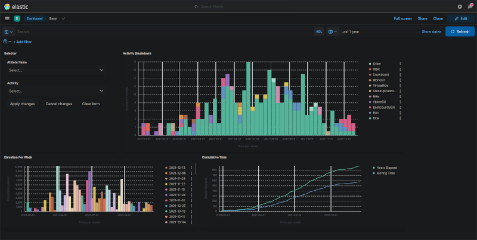
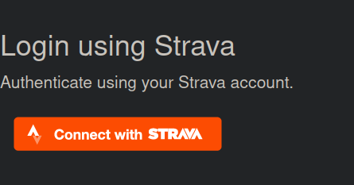
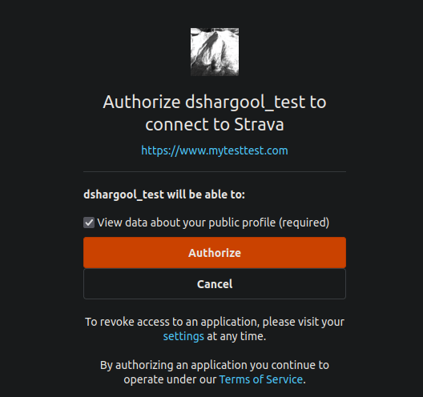
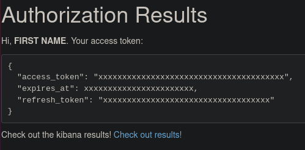
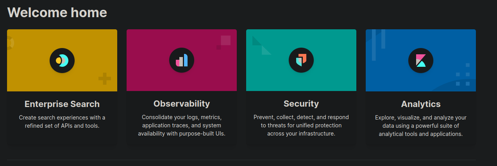
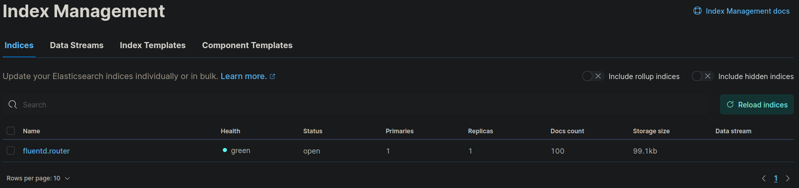
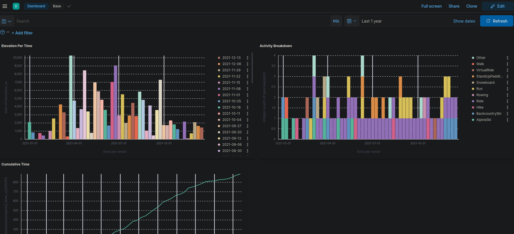

# do-k8s-log-monitor

## Summary
A Kubernetes stack that enables users to load their [Strava](https://www.strava.com/) activity data into ElasticSearch/Kibana for a different way of visualizing the information.
Currently pulls in the data for the year 2021 but can be expanded upon for other years in future releases.

  

## Steps to setting up
1) Learn about the EFK (Elasticsearch Fluentd Kibana) stack and the components it comprises of.
	- Elasticsearch powers the search engine so we can find what we're looking for in our data
	- Logstash is a data processing pipeline that transforms our logs into searchable data
	- Kibana is the webserver that let's us see our beautiful data.
2) Decide what data we want to ingest.
  - It's not logs but it'd be useful to log my physical activities and see their stats on a webpage.
  - We can just have a python script run to ingest the data from Strava's API (I guess) and ingress into Fluentd
3) Build our log capturing code
  - [x] Strava Authentication on a Flask WebApp
  - [x] Log all of our authenticated users data to fluentd
  - [x] Set up docker container to host Flask app that will process our data (should we have a worker that does this instead?)
4) Deploy the stack locally
  - [x] Use docker to deploy small scale locally so we understand the information flow
    - [x] ElasticSearch (Issue with not enough memory on computer so it just errors out with Error 137)
    - [x] Fluentd
    - [x] Kibana
4) Deploy to DigitalOcean!
  - [x] Set up our webpage pods that allow users to interact
  - [x] Set up fluentd to capture the logs from our webpage pods
    - What services do we need in kubernetes to allow chatter?
  - [x] Set up Elasticsearch so there's somewhere for the data to go
  - [x] Set up Kibana so we can see the data
5) Success!

## Running the application
1) Create a Kubernetes cluster on DigitalOcean: https://docs.digitalocean.com/products/kubernetes/quickstart/
2) Connect to your Kubernetes cluster using one of the two approved methods. https://docs.digitalocean.com/products/kubernetes/how-to/connect-to-cluster/
3) Pull down the repository to a local folder
4) Build both the my-fluent and strava-ingest docker containers into your DigitalOcean container registry
``` bash
sudo docker build -t registry.digitalocean.com/k8s-challenge/strava_ingest --no-cache strava_ingest/.
sudo docker push registry.digitalocean.com/k8s-challenge/strava_ingest
sudo docker build -t registry.digitalocean.com/k8s-challenge/my-fluent stack/fluentd/. --no-cache
sudo docker push registry.digitalocean.com/k8s-challenge/my-fluent:latest
```
5) Navigate to the k8s project folder.
6) Enter your Strava secrets into `secrets.yaml` this will be your Client ID and Client Secret from https://www.strava.com/settings/api .  They should be encoded to base64 as per common practice in Kubernetes.  You can also do other fancy encryption things.
6) Ensure that you are connected to your kubernetes cluster by entering the command `kubectl get nodes`
7) Set up the namespace `kubectl apply -f strava-logging.yaml`
8) Set up the secrets `kubectl apply -f secrets.yaml`
9) Set up the elasticsearch service `kubectl apply -f elasticsearch_svc.yaml`
10) Set up the elasticsearch stateful set (Pods and PersistentVolumes) `kubectl apply -f elasticsearch_statefulset.yaml`
11) Set up the fluentd service and pods `kubectl apply -f fluentd.yaml`
12) Set up the kibana service `kubectl apply -f kibana_svc.yaml`
13) Set up the kibana pod deployment `kubectl apply -f kibana_deploy.yaml`
14) Set up the strava ingest webpage deployment `kubectl apply -f strava_ingest_deploy.yaml`
14) Set up the strava ingest service `kubectl apply -f strava-ingest-svc.yaml`
15) Expose the application to the internet `kubectl apply -f app_lb.yaml`
15) Create the ingress-nginx controller
```
kubectl apply -f https://raw.githubusercontent.com/kubernetes/ingress-nginx/main/deploy/static/provider/cloud/deploy.yaml
```
16) Since we don't have a domain name, get the IP address assigned to the ingress-nginx controller and add it to our Strava API page as a valid 'Authorization Callback Domain'
17) Navigate to our IP address and authenticate with Strava
18) Upon successful login we can go to Kibana and see our data!

## Usage
1) Navigate to the IP address of the ingress controller and you will be brought to the login page:
  
2) Authenticate with Strava and you will be brought to the Strava OAuth page
  
3) Upon successful authentication you will be brought back to the Authorization Results Page
  
4) Follow the link at the bottom to be brought to Kibana
  
5) Configure Kibana Indexes to use fluentd.router
  
6) Set up a dashboard with pretty graphs
  

## To-Do
 - [x] nginx reverse proxy sitting out front of application
 - [ ] SECURITY
 - [ ] Set up database to store user information and last pulled time otherwise we get duplicate data
 - [ ] Have worker that will sync user data after authentication
 - [ ] Make a better UI for users to authenticate and then go to Kibana
 - [x] Default dashboards?
 - [ ] Switch from DigitalOcean tutorial ElasticSearch to elastic.co version

## Resources
- https://www.digitalocean.com/community/tutorials/how-to-set-up-an-elasticsearch-fluentd-and-kibana-efk-logging-stack-on-kubernetes
- https://smirnov-am.github.io/running-flask-in-production-with-docker/
- https://www.digitalocean.com/community/tutorials/how-to-set-up-an-nginx-ingress-with-cert-manager-on-digitalocean-kubernetes
